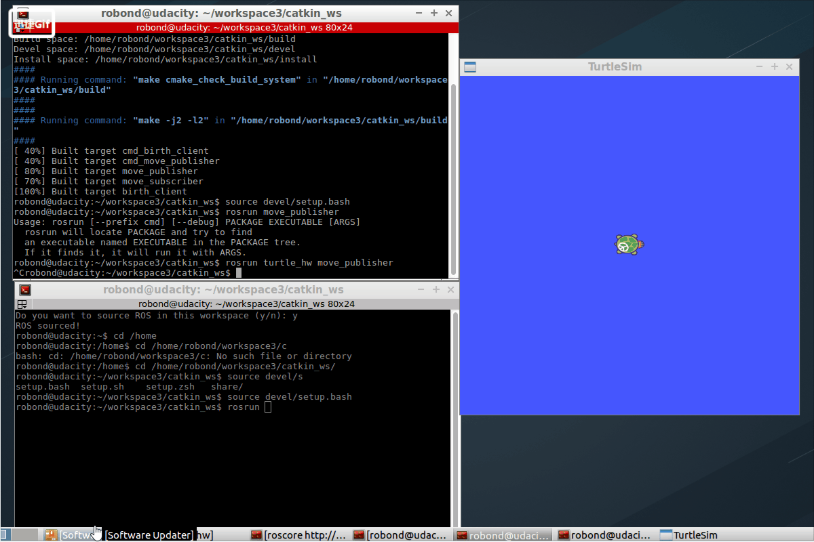
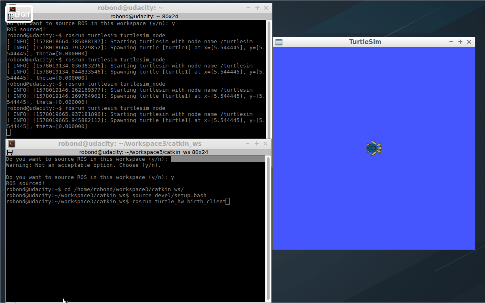

# ROS_Demos

## Project 1 - ROS Communication (Topic/Service)
1. Create a Publisher and command the turtle for circular motion
   Create a Subsciber node to display its pose info.

2. Create a Server node and give birth to a new turtle.

3. Give birth to a new turtle & Command the motion of the turtle via Command Prompt.

